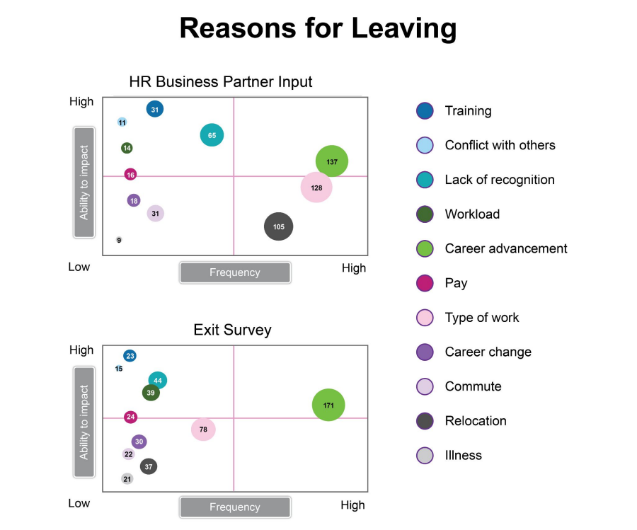

# Evidência de entrega
Projeto individual do módulo 5 do curso de Análise de Dados pelo Senac em parceria com a Resilia Educação

## Situação
Você foi contratado como analista de dados e seu chefe, o Chief Marketing Officer (**CMO**),
pediu que você trabalhasse com seu Parceiro de Negócios de Recursos Humanos (**HRBP**) para
entender o que está causando a evasão de pessoas na organização de marketing e apresentar
suas descobertas

### Proposta

Você deve carregar os dados para o Tableau e criar um ou mais dashboards, identificando as
razões de saída dos funcionários da empresa e seus impactos, e indicando possíveis soluções
para esses problemas. Em seguida, responda às seguintes questões:

1. O que está sendo mostrado aqui? Escreva um texto explicando os dados.
Dica: imagine que você precisa explicar esse gráfico para o seu chefe. Escreva sobre como
você faria isso em voz alta (fazendo suposições conforme necessário).
2. Que observações você pode fazer a partir desses dados? Coloque duas
conclusões específicas em palavras. Escreva sentenças completas.
3. O que não é ideal ou poderia ser evitado na visualização em sua forma atual? Que
perguntas você faria ou que feedback daria para quem fez o gráfico?
Exemplo: suponha que seu HRBP gastou muito tempo criando esse gráfico; como você pode
ajustar seu feedback para que ele não se ofenda?
4. Crie três maneiras diferentes de mostrar esses dados e liste quais são algumas vantagens
e insuficiências de cada uma.
5. Qual visualização representa melhor os dados e por quê?
6. Como você pode gerar essas informações em uma história orientada por dados para seu
7. chefe? O objetivo é pensar além de mostrar simplesmente dados e mostrar o contexto da
história.
